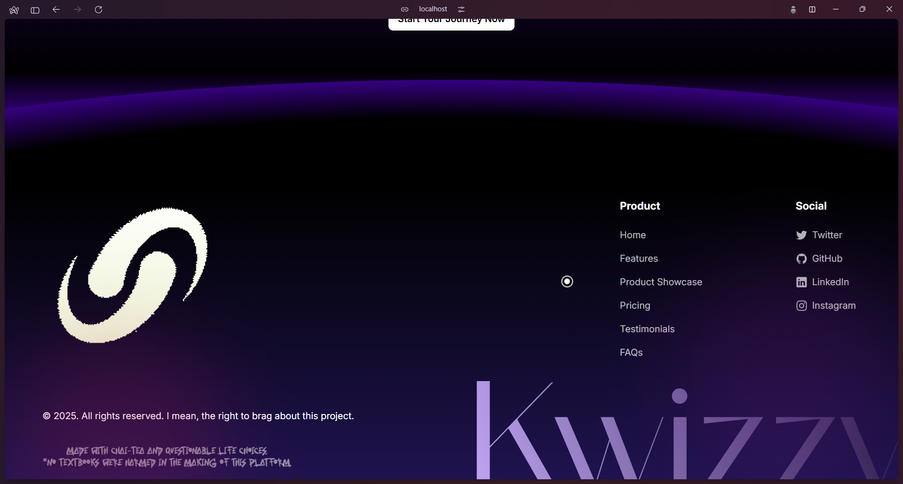
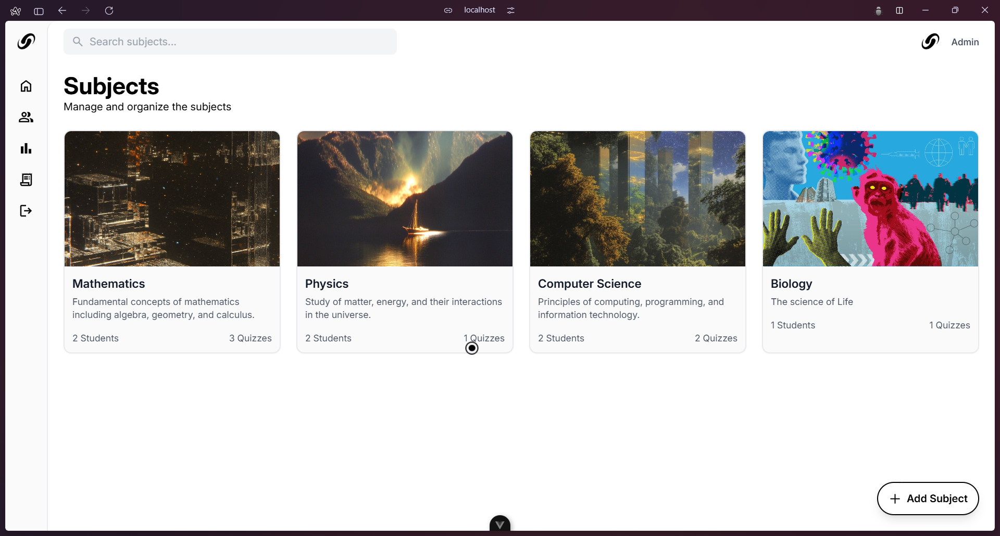
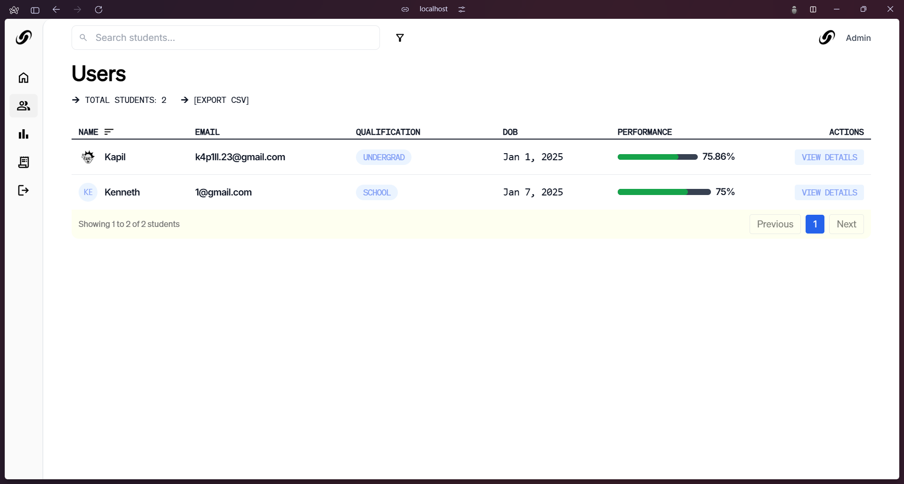
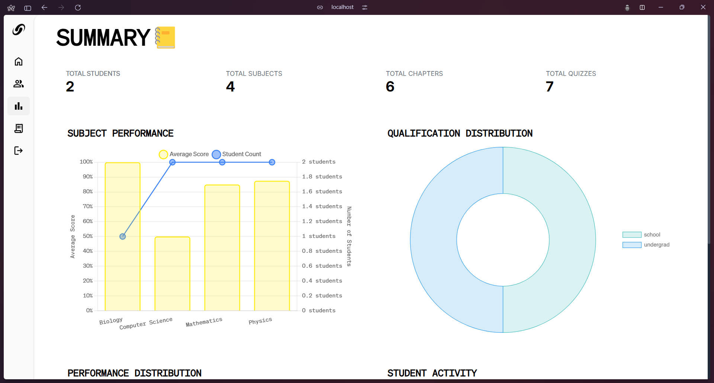
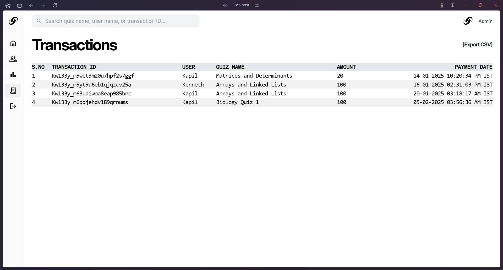
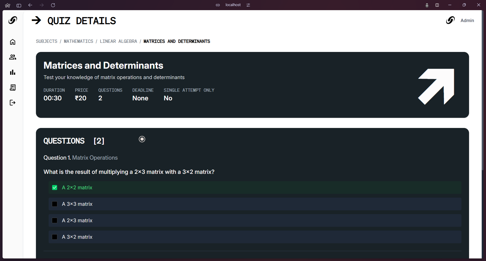
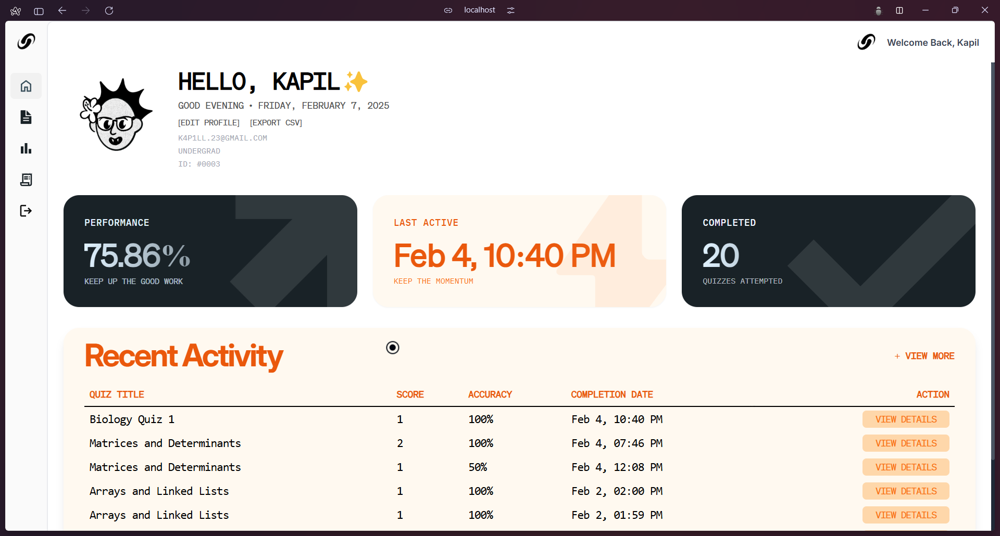
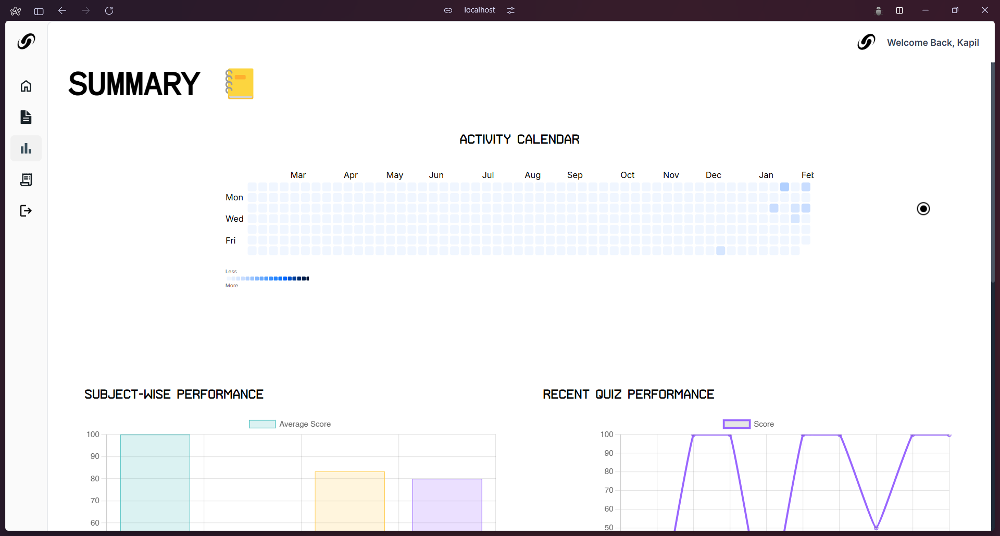
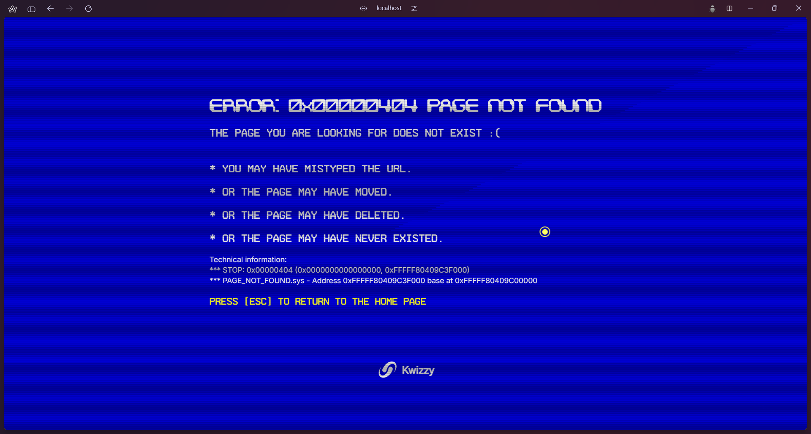
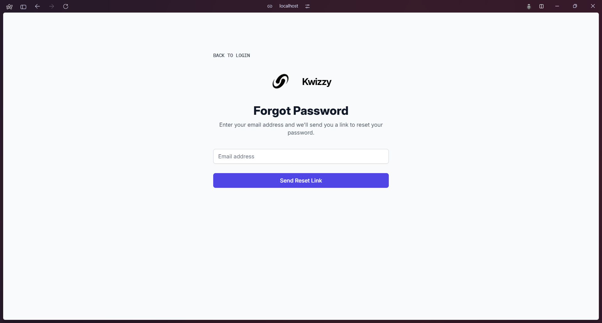

[](https://wakatime.com/badge/user/b8066bef-4f51-4cb8-9339-8c7438e7dc07/project/40b20436-2644-4d77-85c5-fb7bd52f0668)

# Kwizzy

#### As part of my Modern Application Development-2 (MAD2) course at IIT Madras, I developed a software for users and administrators to enhance exam preparation across multiple courses. It offers a structured and interactive environment for students to take assessments and track their progress, while administrators can manage courses, quizzes, and user accounts.

<pre>
🡺 Key Features:
🎯 JWT-based authentication with role-based access control (Admin/Student).
📊 Real-time performance analytics using Chart.js
📱 Mobile-responsive Vue.js frontend
⏰ Celery-powered daily reminders & monthly reports + async jobs for CSV export.
🔒 Protected API endpoints with proper authorization
🛑 Deadline-based availability control +Single-attempt restriction capability. 
💳 Secure payment processing for premium quizzes +Transaction history tracking
✨ Responsive design using Tailwind CSS + Intuitive navigation with Breadcrumbs
</pre>


<pre>🡺 Designed scalable DB schema with 10+ interconnected tables.
🡺 Implemented CSV export for quiz results and transactions.
🡺 Reduced server load by using Redis caching.
🡺 Created 25+ RESTful API endpoints with Flask-RESTful. 
🡺 Implented Email rate limiting so that the emails don't cross the free tier.
</pre>

### Screenshots














<pre>
🡺 Tech Stack:
🐍 Backend: Flask, Flask-RESTful, SQL Alchemy, SQLite
🖥️ Frontend: Vue.js 3, Pinia, Tailwind CSS
🔐 Authentication: Flask JWT Extended
🤖 Async Tasks: Celery with Redis
📊 Data Visualization: Chart.js
⚡ Caching: Redis
✉️ Email Service: Brevo
</pre>


## Installation

#### Clone the Repository

```
git clone https://github.com/kapilovsky/MAD-2-Kwizzy.git

```

#### Change the working directory

```
cd Kwizzy/server
```

####

#### Create a New virtual environment

```
python3 -m venv .venv
```

#### Activate the virtual environment

```
source .venv/bin/activate 

```

#### Install all the depedenices

```
- pip install -r requirements.txt
- npm install
(Inside the client folder)
```

#### Run the app

```
python main.py
npm run dev

```

## Demo

[Link to demo deployed on Render + Vercel ↗️](https://kwizzy-frontend.vercel.app//)

[Link to Project Demonstration Video ↗️](https://youtu.be/6NXlHdun2yQ?feature=shared)


